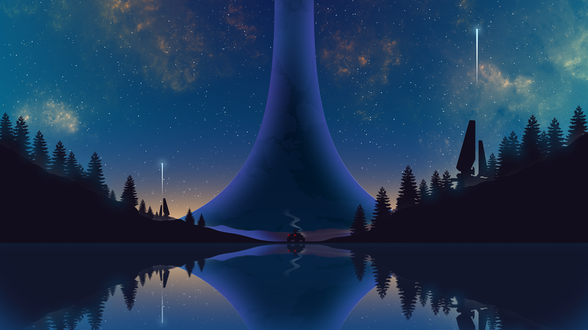
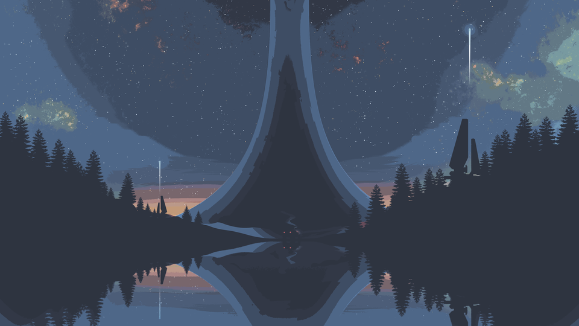
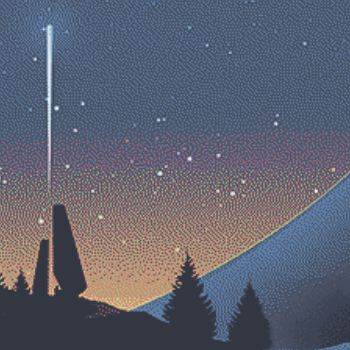
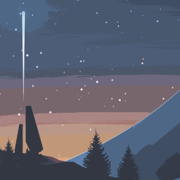

# Nordify

Convert images to the Nord palette without artifacts.

<p align="center">
  
  
</p>

---

## Why?

All other available tools I tried either got the colors wrong, or produced dot-artifacts typical from the Floyd-Steinberg algorithm:

<table>
<tr>
<td align="center" width="33.33%">
  
  <br />
  <em>Original</em>
</td>
<td align="center" width="33.33%">
  
  <br />
  <em>Floyd–Steinberg</em>
</td>
<td align="center" width="33.33%">
  
  <br />
  <em>Mine</em>
</td>
</tr>
</table>


## How to Use

I recommend to use the `uv` package manager. Then just clone the repo and run the python script on your image:

```commandline
git clone https://github.com/kikefdezl/nordify.git
cd nordify

uv sync
uv run main.py input.png output.png
```

I recommend default options since they work very well, but you can experiment with other options:
```commandline
--no-expand               Use only original 16 Nord colors
--expansion-factor (num)  Number of interpolated colors (default: 3)
--rgb-distance            Use RGB distance instead of perceptual LAB
```
